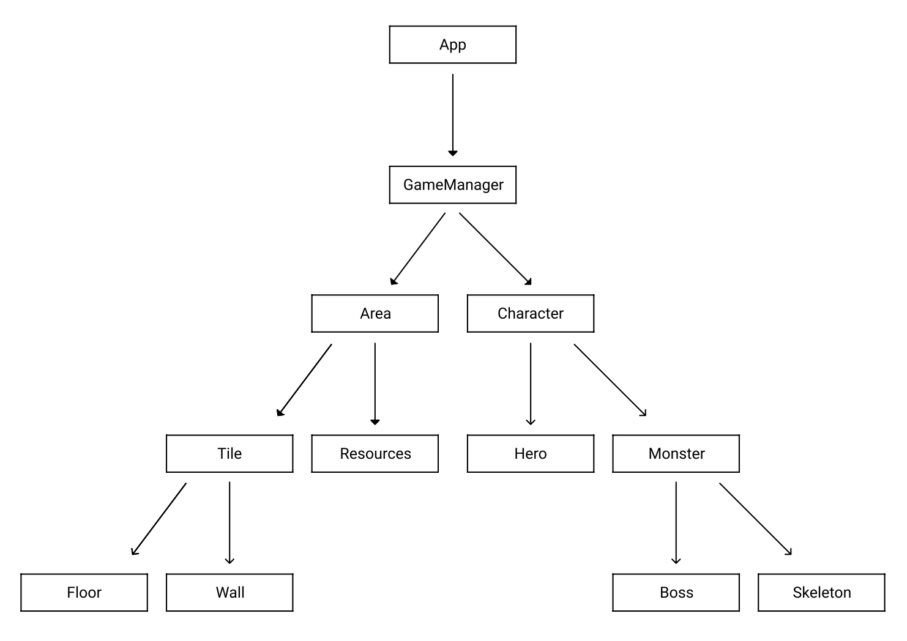

# Wanderer by Mark Ambrus

## Project structure:
The project folder includes all relevant files for the project.
There are 11 .py scripts and the assets folder that contains 8 .gif images.
2 of those are for the two types of tiles, 4 for the hero and 2 for the two
types of monsters.

## Required to launch:
1. Have the repository cloned to your device.
2. Have Pthon 3.x installed on your device.
The program was written in python3.9.0 and is meant to be used with Python 3.x.

## How to use:
1. Open the terminal and navigate inside the directory.
2. Type "python3 main.py" to start the app.
```bash
python3 main.py
```
3. Use the arrow keys or WASD to move the hero around
4. Close the application window once finished.

## Notes:
After further discussion with the client (Béres Roland aka Johny), we came to
the conclusion that the "battle" should take place as soon as the hero is on
the same tile as a monster, without the need of the player to press `space`.

The project is uploaded as a directory of a repository instead of a separate
repository with the permission of the client.

## Code structure:

The app contains the following classes:




The **App** class sets up the graphical user interface, deals with the player's
inputs and includes the mainloop.

The **GameManager** class manages most of the game logic. It creates the
characters and the area. It also keeps count of the area and the kill count.

The **Area** class defines the size of the game area, the position of the tiles
and counts the turns. It has methods for creating a random map, displaying
it on the canvas and displaying characters on the canvas.

The **Tile** class contains basic info about the tiles. It has two sub-classes,
**Floor** and **Wall**.

The **Character** class stores the name, the stats and the position of the
characters. It has two sub-classes, **Hero** and **Monster**. The **Hero**
class contains attributes and methods specific to the hero. The **Monster**
class has two sub-classes, **Boss** and **Skeleton**.

The **Resources** class defines the path to all images needed to run the
program and stores them in a dictionary.


The program starts by creating an object of the **App** class.
